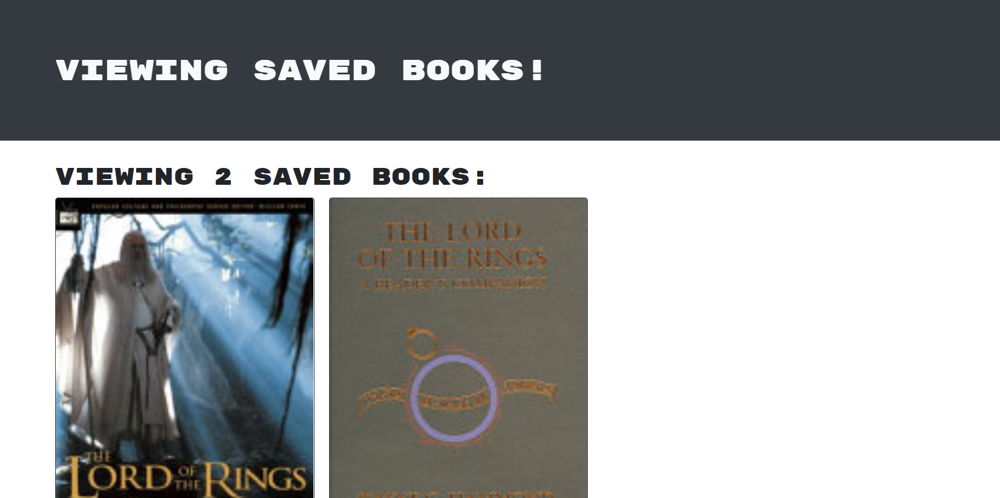

# Book Search Engine 

## User Story 

AS AN avid reader 
I WANT to search for new books to read 
SO THAT I can keep a list of books to purchase 

## Description: 
The application has login/logout/create profile functionality. It allows the user, once they have   logged in, to search books and add them to a list, which they can find under "See Your Books",  as demonstrated in the picture below. Once the book has been read or is no longer desired, the user  can remove it from their list. 

## Screenshot

## Deployment
Github:https://github.com/Cuttingham/book-search-engine  
Heroku: https://git.heroku.com/stormy-gorge-06357.git